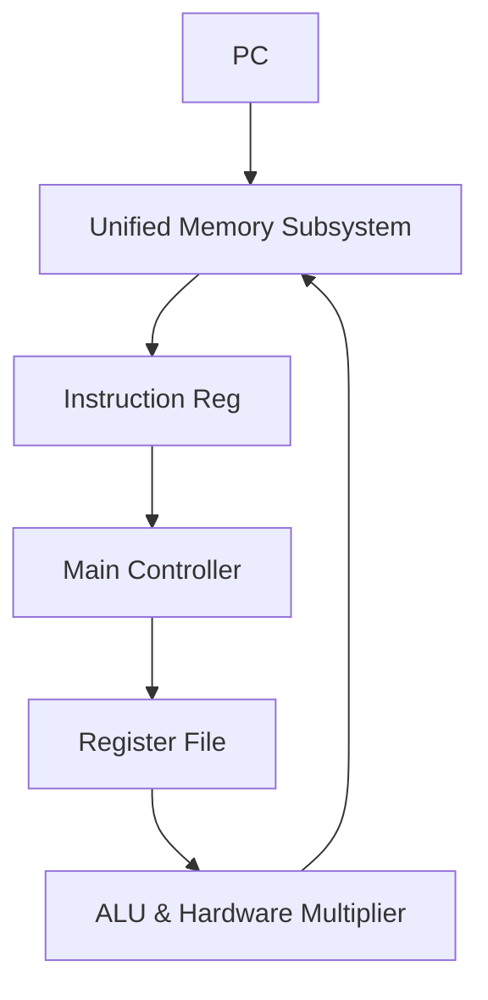

# RISC-V Complex Engineering Project (CEP) Processor Architecture

## Executive Summary
**RISC-V Complex Engineering Project (CEP) Processor Architecture** is a **Complex Processor Systems** project implemented in SystemVerilog/Verilog and verified using AMD/Xilinx Vivado Simulator.

Comprehensive RISC-V Complex Engineering Project core featuring extended instruction support, unified memory, and register file initializers.

---

## Architectural Block Diagram

---

## Core Key Features & Highlights

- Unified Instruction & Data Memory Architecture.
- Hardware Multiplication Unit integration (`Mul.sv`).
- Dual-register operand routing multiplexers (`ALU_source1.sv`, `ALU_Source_2.sv`).

---

## Source Code & Module Index

| File Name | Module Name | Key Interface Signals |
| :--- | :--- | :--- |
| `immediate_gen.sv` | `immediate_gen` | `ins` (input), `output logic` (input) |
| `pc.sv` | `program_counter` | `pc` (output), `input  logic` (output), `clock` (input) |
| `pc_immediate.sv` | `pc_immediate` | `pc_1` (input), `output logic` (input), `dataW` (input) |
| `data_mem.mem` | `data_mem.mem` | Internal Module / Support File |
| `ins_file.mem` | `ins_file.mem` | Internal Module / Support File |
| `reg.mem` | `reg.mem` | Internal Module / Support File |
| `data_mem.sv` | `data_mem` | `rd` (output), `input logic` (output), `clock` (input) |
| `EX_MEM_reg.sv` | `Hazard_unit` | `rs1_D` (input), `input  logic` (input), `rd_E` (input) |
| `ins_mem.sv` | `Instruction_memory` | `pc_byte_address` (input), `output logic` (input), `r2` (output) |
| `MEM_WB_register.sv` | `MEM_WB_register` | `MEM_WB_pc` (output), `output logic` (output), `EXEC_MEM_pc` (input) |
| `reg_mem.sv` | `reg_file` | `rd` (input), `input logic` (input), `r1` (input) |
| `reg_top_tb.sv` | `tb_Generic_pipeline_reg_reg` | Internal Module / Support File |
| `ID_EXEC_reg.sv` | `Generic_pipeline_reg_reg` | `clock` (input), `input  logic reset` (input), `input  logic stall` (input) |
| `IF_ID_register.sv` | `IF_ID_register` | `pc` (input), `input logic` (input), `IF_ID_pc` (output) |
| `Reg_top.sv` | `forwarding_testbench` | Internal Module / Support File |
| `mul_tets.sv` | `mul_tets.sv` | Internal Module / Support File |
| `ALU.sv` | `ALU` | `ALU_control` (input), `input logic` (input), `data2` (input) |
| `ALU_con.sv` | `alu_control` | `ALU_op` (input), `input logic` (input), `fun11` (input) |
| `mul.sv` | `multiplication_module` | `ALU_control` (input), `input  logic` (input), `data2` (input) |
| `mul_mux_1.sv` | `mul_mux` | `opcode` (input), `input logic` (input), `alu_result_final` (output) |
| `Mul_output_mux.sv` | `Mul_output_mux` | `fun11` (input), `input logic` (input), `lo` (input) |
| `sll.sv` | `pc_adder` | `pc` (input), `output logic` (input) |
| `mux.sv` | `mux_3` | `zero` (input), `input branch` (input), `input logic` (input) |
| `mux_1.sv` | `MUX_1` | `data_from_reg2` (input), `input logic` (input), `data2` (output) |
| `mux_2.sv` | `MUX_2` | `alu_data` (input), `input  logic` (input), `mem_to_reg` (input) |
| `mux_f_1.sv` | `mux_f_1` | `datareg` (input), `data_exec` (input), `data_mem` (input) |
| `mux_f_2.sv` | `mux_f_2` | `datareg` (input), `data_exec` (input), `data_mem` (input) |
| `Control_unit.sv` | `Control_unit` | `opcode` (input), `output logic memread` (input), `output logic memwrite` (input) |
| `Forwading_unit.sv` | `Forwading_unit` | `id_exec_regWrite` (input), `input logic exec_mem_regWrite` (input), `input logic` (input) |
| `write_back_jump.sv` | `write_back_jump` | `jump` (input), `input logic` (input), `ra` (output) |
| `tb_top_func_synth.v` | `pipeline_top` | `clock` (input), `reset` (input) |
| `top_tb.sv` | `top_tb` | Internal Module / Support File |
| `TOP.sv` | `top` | `clock` (input), `input  logic        reset` (input), `output logic` (input) |

---

## Hardware Simulation & Verification Guide

### Prerequisites
- **AMD / Xilinx Vivado Design Suite** (2020.1 or newer recommended)
- **ModelSim / Icarus Verilog / GTKWave** (Optional alternative simulators)

### Step-by-Step Execution in Vivado
1. **Open Vivado IDE** and launch a new project.
2. Select **RTL Project** without specifying sources initially.
3. Choose your target FPGA Device (e.g. `xc7a35tcpg236-1` Artix-7 or generic).
4. Click **Add Sources** -> **Add or Create Design Sources** and add all `.sv` / `.v` / `.mem` files from this repository.
5. Set the primary top-level module (e.g. `TOP.sv` / `top.sv`) as **Top Module**.
6. Navigate to **Flow Navigator** -> **Simulation** -> **Run Simulation** -> **Run Behavioral Simulation**.
7. Observe the waveform outputs in `xsim` to confirm state transitions and signal behavior.

---

## Author & Contact Details

Developed and maintained by **Mohammad Usman Irshad**.

* **GitHub Profile**: [@usman-irshad1](https://github.com/usman-irshad1)
* **Email**: [217554659+usman-irshad1@users.noreply.github.com](mailto:217554659+usman-irshad1@users.noreply.github.com)
* **Domain**: Digital Design, Verilog/SystemVerilog HDL, Computer Architecture & RISC-V Processor Cores.
